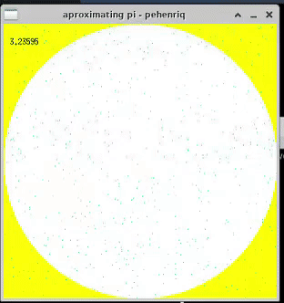

# aproximating-pi
This project estimates the value of pi using the Monte Carlo algorithm.
It creates a visual representation with 42's mlx, a super small graphics library for C.

Any comment is welcome.

